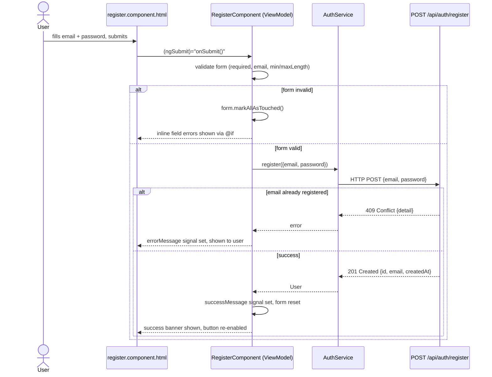

# User Story: Register an Account

> As a new user, I want to register an account with an email and password, so
> that I can later log in and access the application.

**Route:** `/register`
**Backend endpoint:** `POST /api/auth/register` (see `docs/register-user.md` in the `taskflow` backend repo)

## Flow



## Components involved (MVVM)

| Layer | File | Responsibility |
|---|---|---|
| Model | `core/auth/auth.service.ts` (`AuthService`) | Owns the auth API call; `register()` POSTs to `/api/auth/register` via `HttpClient` |
| Model (DTOs) | `models/user.model.ts` | `RegisterRequest` (`email`, `password`) mirrors the backend request; `User` (`id`, `email`, `createdAt`) mirrors the backend's `RegisterResponse` |
| ViewModel | `features/auth/register/register.component.ts` (`RegisterComponent`) | Holds the reactive form, `isSubmitting` / `errorMessage` / `successMessage` signals, calls `AuthService.register()`, resets the form on success |
| View | `features/auth/register/register.component.html` | Binds to `form` controls and signals; no logic beyond `@if` checks on control state |
| Shared/presentational | `shared/toast/toast.component.ts` (`ToastComponent`) | Dumb component — takes `message`/`type` inputs, auto-dismisses after 4s or on click, emits `dismissed`; knows nothing about auth or HTTP |
| Routing | `app.routes.ts` | Lazy-loads `RegisterComponent` on `/register`; `''` redirects to `/register` |
| HTTP wiring | `app.config.ts` | `provideHttpClient()` makes `HttpClient` available for injection into `AuthService` |

## Request / Response

Mirrors the backend contract exactly — no `name` field, and registration does **not** return a token. A separate `POST /api/auth/login` call is required to authenticate (see the Login user story once implemented).

**Request**

```json
POST /api/auth/register
{
  "email": "jane@example.com",
  "password": "SuperSecret123"
}
```

**Success — `201 Created`**

```json
{
  "id": "b3f1c9a0-...-...",
  "email": "jane@example.com",
  "createdAt": "2026-07-15T12:00:00Z"
}
```

## Validation & error cases

| Condition | Where enforced | User-visible behavior |
|---|---|---|
| Email blank or malformed | `Validators.required`, `Validators.email` on the `email` control | Inline error once the field is touched: "Enter a valid email address." |
| Password shorter than 8 or longer than 72 characters | `Validators.minLength(8)`, `Validators.maxLength(72)` on the `password` control | Inline error once the field is touched |
| Form submitted while invalid | `onSubmit()` guards on `form.invalid` | `form.markAllAsTouched()` reveals all field errors; no request is sent |
| Email already registered | Backend `409 Conflict` (`ProblemDetail`) | `error.error.detail` rendered in a red banner above the submit button |
| Any other backend/network error | HTTP error handler in `onSubmit()` | Falls back to "Registration failed. Please try again." |
| Success | Backend `201 Created` | Green success banner shown, form reset, submit button re-enabled |

## State management

`RegisterComponent` holds three signals as local ViewModel state — no shared/global state is touched, since a successful registration does not authenticate the user:

- `isSubmitting` — disables the submit button and swaps its label while the request is in flight; reset to `false` on **both** the success and error paths (a prior bug only reset it on error, which combined with an early `router.navigate(['/login'])` to a not-yet-existing route left the button permanently disabled after a successful registration)
- `errorMessage` — set from the backend's `ProblemDetail.detail`, cleared at the start of each submit attempt
- `successMessage` — set to a confirmation string on success, cleared at the start of each submit attempt

`AuthService.currentUser` / `isAuthenticated` are left untouched by `register()` — they'll be populated by the Login story instead. Redirecting to `/login` after a successful registration is deferred until that route exists.
